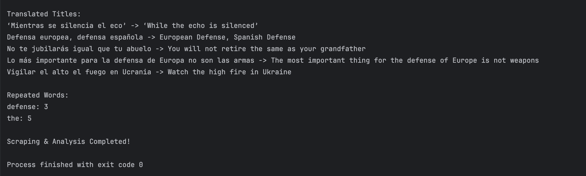
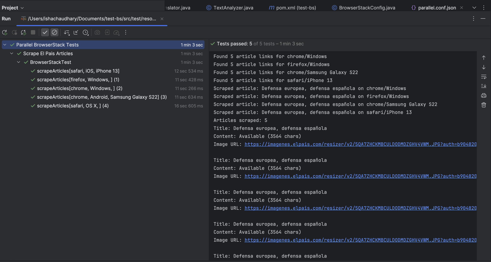

# 🧪 Browser Testing & Web Scraping with Selenium

This project automates article scraping from [El País](https://elpais.com/) using Selenium and performs cross-browser testing on BrowserStack.

## 📌 Features
- ✅ Scrapes the **first five** articles from the Opinion section.
- ✅ Extracts **title, content, and cover image** of each article.
- ✅ **Translates article headers** from Spanish to English using an API.
- ✅ **Analyzes translated headers** for repeated words.
- ✅ **Runs cross-browser tests** on BrowserStack in parallel.

---

## 📂 Installation & Setup

### 🔹 1. Clone the Repository
```sh
git clone https://github.com/your-username/browserTesting.git
cd browserTesting

Install dependencies (if required):

mvn clean install  


## Output Screenshots  







## ✍️ Authored By  
Isha Chaudhary
